# Assignment - 28 Full Stack Web Development using Python MySirG Postgres DB

    Qns 1. Create a table (student) with 3 columns (rollno, name, course).

    Ans.
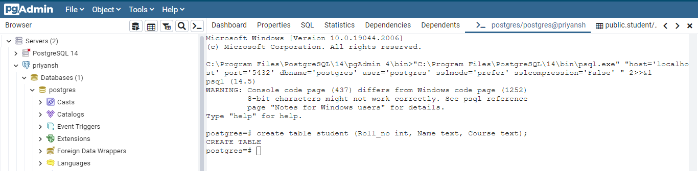
# and
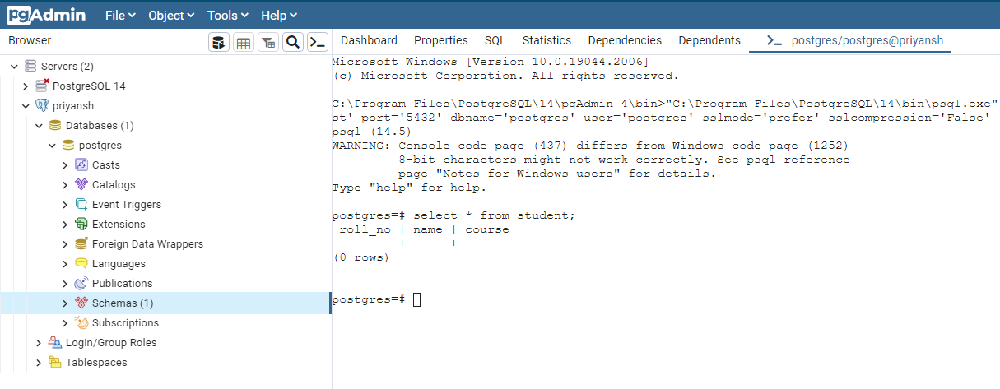

    Qns 2. Insert records for 4 students.

    Ans.
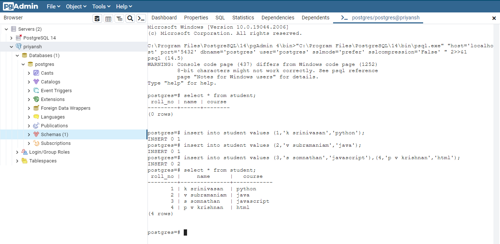

    Qns 3. Write a Select query to fetch all the students.

    Ans.
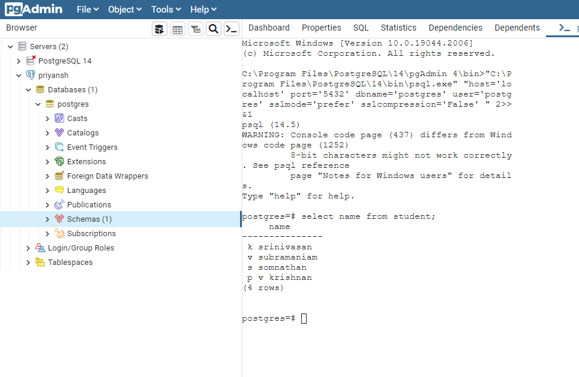

    Qns 4. Update the student name of rollno 3 with ‘Mohan’.

    Ans.
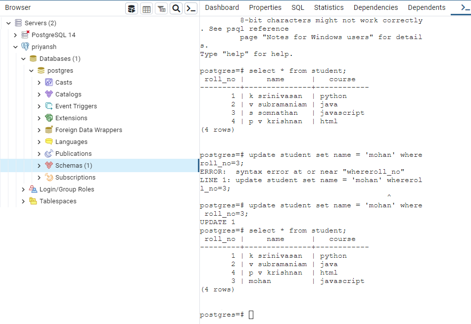

    Qns 5. Delete any student from table with their rollno.

    Ans.
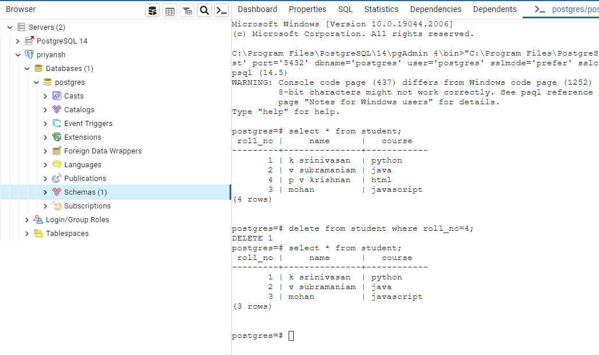

    Qns 6. Delete all the data from student table.

    Ans.
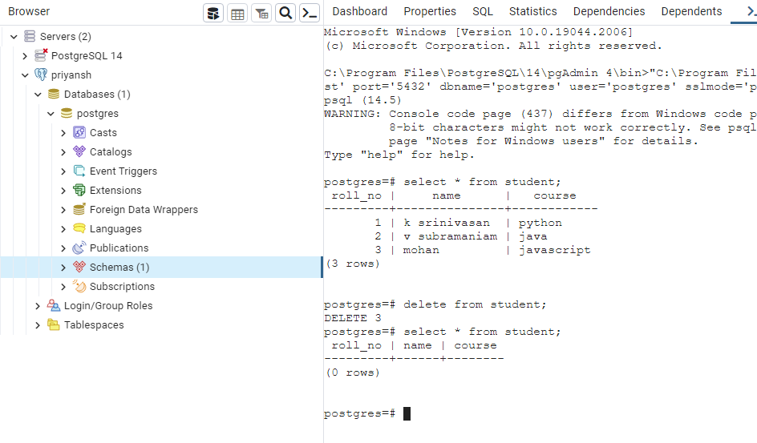

    Qns 7. Drop the student table.

    Ans.
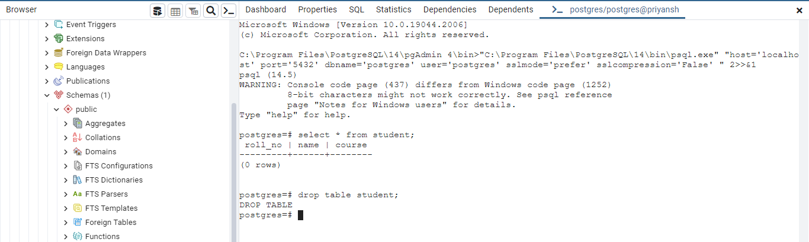

    Qns 8. Create Courses table (cid, cname) where cid is a primary key and Student table
    (rollno, name, cid) where rollno is a primary key and cid is a foreign key.

    Ans.
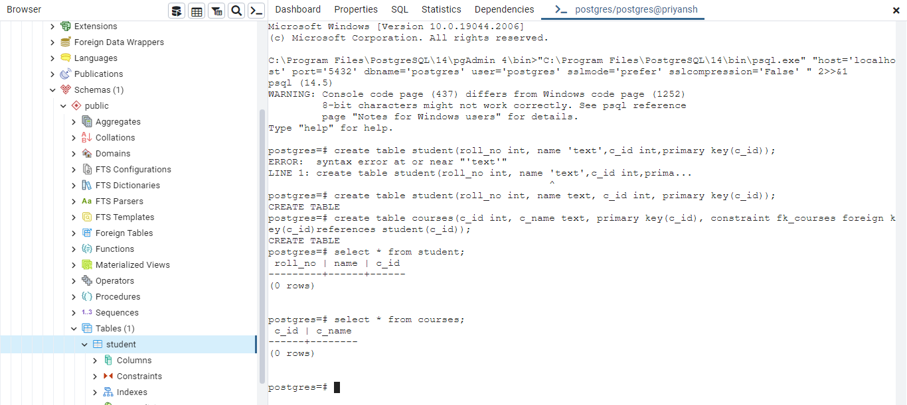

    Qns 9. Insert data in both the tables.

    Ans.
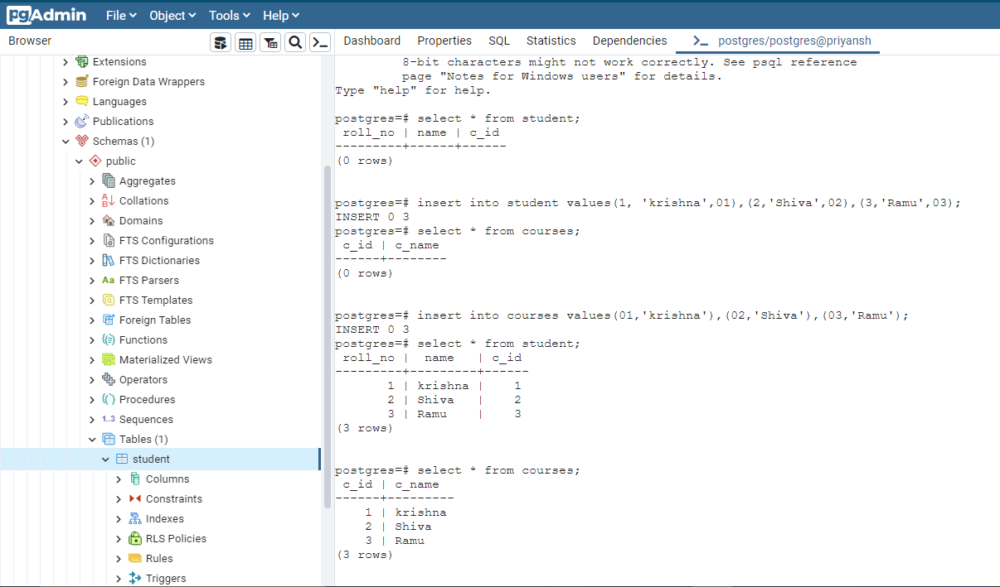

    Qns 10. Select all the students who are doing a specific course, eg. Python.

    Ans.
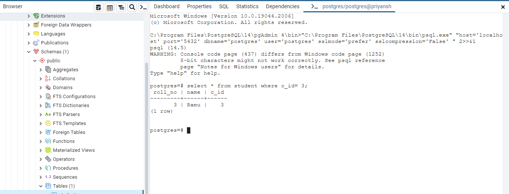